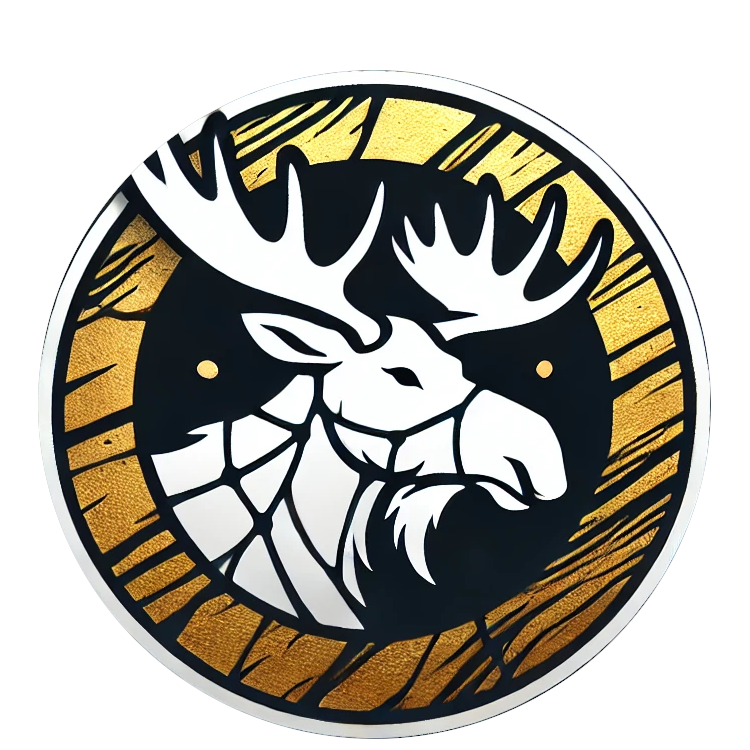
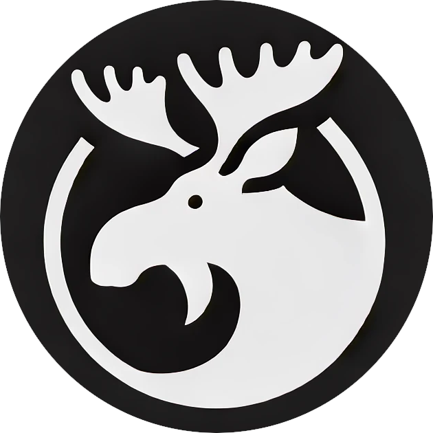

<p align="center" style="font-size: 1.5em;">
  <i>Calamoose Labs Presents</i>
</p>
<p align="center">
  
</p>
<h1 align="center" style="color: gold;">
  <u>K I N T S U G I</u>
  <br />
  <br />
</h1>

**Internal App** is a module federation plugin for Deno, inspired by the concept
of module federation, micro frontends, and microservices. This middleware allows
seamless sharing of components between independent applications by setting up a
federated gateway. As well as providing a federated gateway for backend
services.

---

## Federation

_LibSQL Package_ This will be the package that helps create the database modules
that can be used in the Kintsugi package.

```
Calamoose Labs, Inc.
    |
    |--> [Database Module Name]
    |       |--> [Company ID]
    |              |--> Database Table Name
    |
    |--> [Database Module Name]
    |       |--> [Company ID]
    |       |     |--> Database Table Name
    |       |--> [Company ID]
    |             |--> Database Table Name
    |--> [Database Module Name]
            |--> [Company ID]
                  |--> Database Table Name
```

_Kintsugi_ This will wrap everything up and allow for importing and exporting
and sharing of modules.

Kintsugi should grab the modules from the producers and cache them locally, this
should be done on launch, then when a module server reports that it has a new
version of a module, Kintsugi should check if it needs to update the local
cache. It will maintain a list of all the modules that are available and the
versions that are available. This should allow for a very dynamic and flexible
system, as well as allowing for a system that can be updated over time without
having to redeploy the entire application.

---

## Features

- **Easy Federation**: Share components across apps with minimal setup.
- **Dynamic Imports**: Components are loaded on-demand in the consumer app,
  reducing bundle size.
- **Alias Mapping**: Use simple aliases to reference remote components,
  abstracting away the URL routing.

---

## Getting Started

### Producer/Gateway Setup

To create a producer app or gateway, you need to set up the configuration for
the remote components.

1. **Step One**
   ```typescript
   console.log("Step One");
   ```

2. **Step Two**
   ```typescript
   console.log("Step Two");
   ```

### Consumer Setup

To consume the producer app, you need to set up the alias configuration for the
remote components.

1. **Step One**
   ```typescript
   console.log("Step One");
   ```

2. **Step Two**
   ```typescript
   console.log("Step Two");
   ```

---

## License

Internal App is open-source software licensed under the MIT License.

<p align="right">
  <br />
  <br />
  <span>© 2024 Calamoose Labs, Inc.</span> &nbsp; 
</p>

## TODO

- [ ] Create the Builder class to handle the transpile and build process.
- [ ] Create the Loader class to handle the loading of the modules from the
      producer servers.
- [ ] Create the Watcher class to handle the watching of the files and
      triggering the builder to create the new modules.
